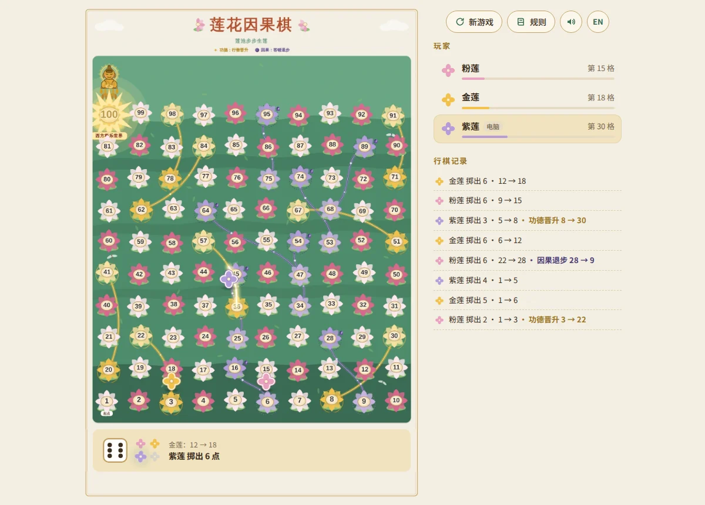

# 莲花因果棋 · Lotus Karma

A browser version of Snakes & Ladders played on the **莲池步步生莲** lotus-pond board.
Golden lotuses are the ladders (功德：行善晋升). Purple lotuses are the snakes (因果：答错退步): stop on
one and you answer a right-or-wrong question, and only a wrong answer sends you down. The first player
to reach **100 · 西方极乐世界** wins.



## Play

- 2–4 players, each seat human or computer, sharing one screen (pass and play).
- Click or tap the dice, or press <kbd>Space</kbd>, to roll.
- Chinese and English interface, sound on/off, and the game is saved in the browser, so a refresh
  picks up where you left off.

## Rules

Snakes & Ladders on the board exactly as drawn, with a question on every purple lotus:

1. All tokens start on lotus 1 (起点) and move forward by the number rolled.
2. Stop on a golden lotus and you climb its golden path. Passing over one without stopping does
   nothing.
3. Stop on a purple lotus and you get a **karma question** (因果考验): answer it correctly and you stay
   on that lotus; answer it wrong and you slide down its purple path. Switch the questions off under
   **New game** to play the classic way, where every purple lotus slides you down.
4. The first token to reach 100 wins. When a roll would go past 100 you either stay where you are
   (classic, the default) or walk to 100 and bounce back for the extra pips; choose this under
   **New game**.

| Golden lotus (up) | 3 → 22 | 8 → 30 | 20 → 41 | 36 → 57 | 51 → 67 | 62 → 84 | 71 → 91 | 78 → 98 |
| --- | --- | --- | --- | --- | --- | --- | --- | --- |
| **Purple lotus (down)** | **16 → 6** | **28 → 9** | **45 → 25** | **54 → 34** | **64 → 47** | **74 → 53** | **89 → 68** | **95 → 75** |

## Karma questions

The questions are written for children aged about 5–9 and are about right and wrong: kindness,
honesty, sharing, manners, safety, and caring for animals and nature.

- 60 questions, each in Chinese and English: 36 "what should you do?" scenarios with three picture
  choices, and 24 "is this right or wrong?" statements.
- Questions are drawn at random and don't repeat until all 60 have been asked. The order of the
  choices is shuffled every time.
- After answering, the card shows the right answer and a one-line reason ("why").
- **读题 / Read aloud** reads the question out for children who can't read yet. It appears when the
  device has a Chinese or English voice, and plays by itself when sound is on.
- Computer players answer too, correctly about 70% of the time.
- Keys <kbd>1</kbd> <kbd>2</kbd> <kbd>3</kbd> pick an answer.

To add or change questions, edit `js/questions.js`. For a scenario, list the right answer first
(the game shuffles the choices) with one emoji per choice; for a statement, set `judge: true` and
`answer: true` (right) or `false` (wrong). `npm test` checks that every question is complete in both
languages.

## Run it locally

The game is plain HTML, CSS and JavaScript modules with no build step. Browsers only load modules
over HTTP, so serve the folder instead of opening `index.html` directly:

```sh
python3 -m http.server 8000   # or: npm start
# then open http://localhost:8000
```

Add `?speed=3` to the address to speed up the animations.

## Put it online with GitHub Pages

1. On GitHub, open **Settings → Pages**.
2. Under **Build and deployment**, choose **Deploy from a branch**, pick the branch that holds these
   files and the `/ (root)` folder, then **Save**.
3. After a minute the game is live at `https://<your-user>.github.io/snake-and-ladder-game/`.

Any static host (Netlify, Vercel, Cloudflare Pages, a plain web server) works the same way: upload
the folder as it is.

## Tests

```sh
npm test
```

The tests cover the rules (moves, ladders, snakes, karma questions, both finishing rules, turn
order, saved-game validation, thousands of simulated games), check that the board data matches the
artwork, and check that every question is complete in both languages.

## How it is built

| Path | What it holds |
| --- | --- |
| `index.html` | Page structure, dialogs and SVG icons |
| `css/style.css` | Layout and styling in the board's palette |
| `js/board-data.js` | Centre of every lotus, the ladders and snakes, and the traced golden/purple paths |
| `js/game.js` | The rules, with no DOM code, so they can be tested in Node |
| `js/questions.js` | The karma questions, in Chinese and English |
| `js/main.js` | Tokens, dice, animations, turns, computer players, saving |
| `js/i18n.js` | Chinese and English text |
| `js/audio.js` | Sound effects synthesised with the Web Audio API, and reading questions aloud |
| `assets/` | The board artwork, cut into the part above the control panel and the frame below it |

The board is the original artwork, unchanged. The dice and flower panel under it is rebuilt as a
working control in the same style: the dice rolls, and the four flowers show which seats are in
play and whose turn it is. Every lotus position and every golden and purple path was measured from
the artwork, so tokens land on the drawn lotuses and follow the drawn lines when they climb or
slide. If the artwork changes, those coordinates in `js/board-data.js` need to be measured again.
