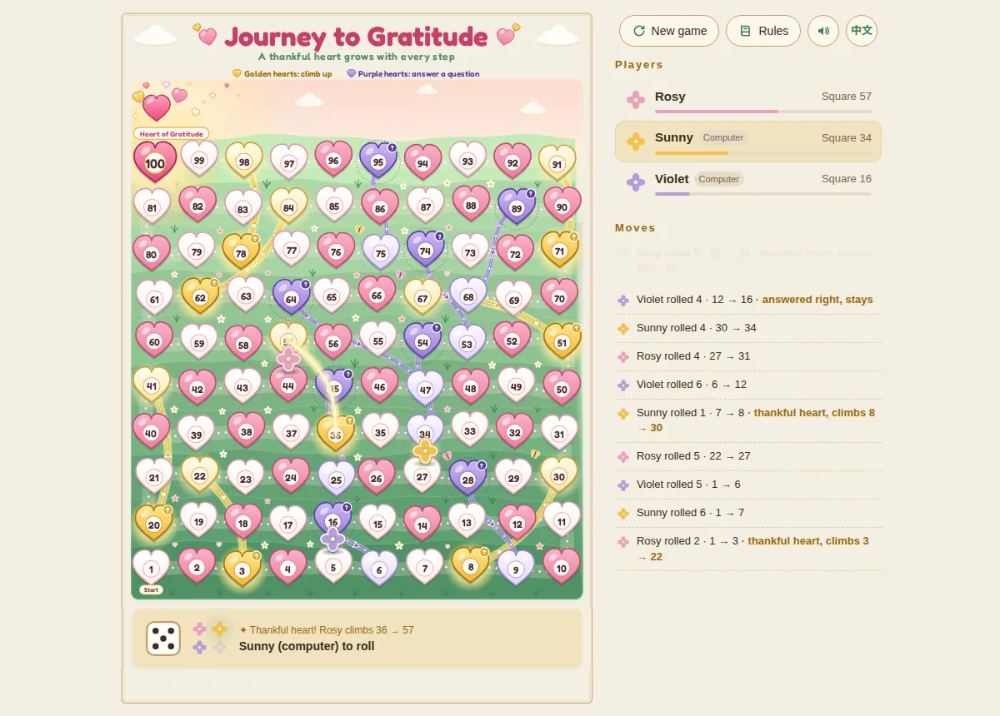

# Journey to Gratitude · 感恩之旅

A browser version of Snakes & Ladders played on a meadow of hearts. Golden hearts are the ladders:
gratitude lifts you up. Purple hearts are the snakes: stop on one and you answer a heart question,
and only a wrong answer sends you down. The first player to reach **100, the Heart of Gratitude**,
wins.



## Play

- 2–4 players, each seat human or computer, sharing one screen (pass and play).
- Click or tap the dice, or press <kbd>Space</kbd>, to roll.
- English and Chinese interface (the board's title and labels switch too), sound on/off, and the
  game is saved in the browser, so a refresh picks up where you left off.

## Rules

Snakes & Ladders on a 10 × 10 board, with a question on every purple heart:

1. All tokens start on heart 1 (Start) and move forward by the number rolled, following the trail:
   left to right along the bottom row, then right to left, winding up the board.
2. Stop on a golden heart and you climb its golden path. Passing over one without stopping does
   nothing.
3. Stop on a purple heart and you get a **heart question**: answer it correctly and you stay on that
   heart; answer it wrong and you slide down its purple path. Switch the questions off under
   **New game** to play the classic way, where every purple heart slides you down.
4. The first token to reach 100 wins. When a roll would go past 100 you either stay where you are
   (classic, the default) or walk to 100 and bounce back for the extra pips; choose this under
   **New game**.

| Golden heart (up) | 3 → 22 | 8 → 30 | 20 → 41 | 36 → 57 | 51 → 67 | 62 → 84 | 71 → 91 | 78 → 98 |
| --- | --- | --- | --- | --- | --- | --- | --- | --- |
| **Purple heart (down)** | **16 → 6** | **28 → 9** | **45 → 25** | **54 → 34** | **64 → 47** | **74 → 53** | **89 → 68** | **95 → 75** |

## Heart questions

The questions are written for children aged about 5–9. More than half are about gratitude: saying
thank you to family, teachers, drivers and nurses, making a thank-you card, looking after what you
are given, not wasting food or water, and finding the good side of a rainy day. The rest are about
kindness, honesty, sharing and staying safe. There is no religious content anywhere in the game,
and a test checks every file in this folder for it.

- 60 questions, each in English and Chinese: 36 "what should you do?" scenarios with three picture
  choices, and 24 "is this right or wrong?" statements.
- Questions are drawn at random and don't repeat until all 60 have been asked. The order of the
  choices is shuffled every time.
- After answering, the card shows the right answer and a one-line reason ("why").
- **Read aloud / 读题** reads the question out for children who can't read yet. It appears when the
  device has an English or Chinese voice, and plays by itself when sound is on.
- Computer players answer too, correctly about 70% of the time.
- Keys <kbd>1</kbd> <kbd>2</kbd> <kbd>3</kbd> pick an answer.

To add or change questions, edit `js/questions.js`. For a scenario, list the right answer first
(the game shuffles the choices) with one emoji per choice; for a statement, set `judge: true` and
`answer: true` (right) or `false` (wrong). `npm test` checks that every question is complete in both
languages.

## Run it locally

The game is plain HTML, CSS and JavaScript modules with no build step. Browsers only load modules
over HTTP, so serve the folder instead of opening `index.html` directly. From the repository root:

```sh
python3 -m http.server 8000
# then open http://localhost:8000/gratitude/
```

Add `?speed=3` to the address to speed up the animations.

## Put it online

With GitHub Pages switched on for this repository (**Settings → Pages → Deploy from a branch**, the
branch that holds these files, `/ (root)`), the game is at
`https://<your-user>.github.io/snake-and-ladder-game/gratitude/`.

The folder is self-contained, so any static host (Netlify, Vercel, Cloudflare Pages, a plain web
server) works too: upload the `gratitude` folder as it is.

## Tests

From the repository root:

```sh
npm test
```

`tests/gratitude.test.js` covers the rules (moves, golden and purple hearts, heart questions, both
finishing rules, turn order, saved-game checks, hundreds of simulated games), checks that the board
picture draws a numbered heart on every square and every golden and purple path, checks that every
question is complete in both languages, and checks for religious words and symbols.

## How it is built

| Path | What it holds |
| --- | --- |
| `index.html` | Page structure, dialogs and SVG icons |
| `css/style.css` | Layout and styling in the board's palette |
| `js/board-data.js` | Centre of every heart, the golden and purple hearts, and the points of every path |
| `js/board-art.js` | Draws the board as SVG from that data: sky, meadow, trail, paths, hearts and labels |
| `js/game.js` | The rules, with no DOM code, so they can be tested in Node |
| `js/questions.js` | The heart questions, in English and Chinese |
| `js/main.js` | Tokens, dice, animations, turns, computer players, saving |
| `js/i18n.js` | English and Chinese text |
| `js/audio.js` | Sound effects synthesised with the Web Audio API, and reading questions aloud |
| `assets/` | The icon and the gold frame round the control panel |

The board is drawn in the browser from `js/board-data.js`, so the picture and the rules always
match: change a golden or purple heart there (and the points of its path) and the board redraws to
match. The words on the board are real text, which is why the title and labels change with the
language.
